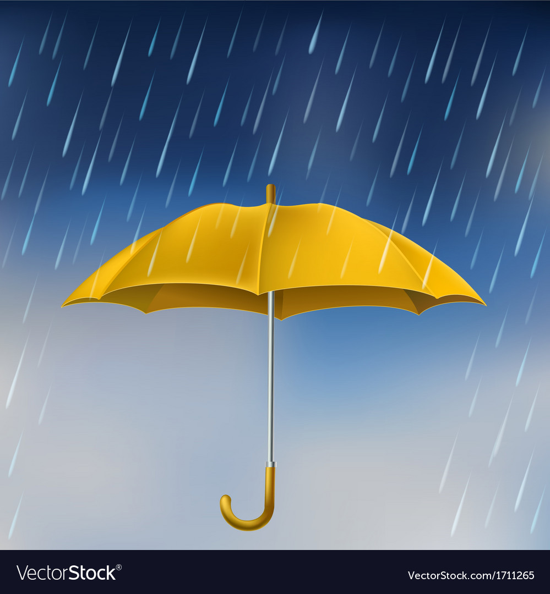

# Weather Station

## an IoT project

### Development Roadmap

- [x] Setup repos
- [x] Initialize environments
- [x] Install dependencies
- [x] setup server.js with express
- [x] setup ESP32
- [ ] set routes

### Worklog and Commits

Date | Commit Message | Version
:-----|:----------------:|:--------:
25.08.23 | initial setup | 0.1.0

### References

- [Web Page Layouts](https://www.youtube.com/watch?v=3C_22eBWpjg)
- [JS Native Fetch](https://www.youtube.com/watch?v=MBqS1kYzwTc)
